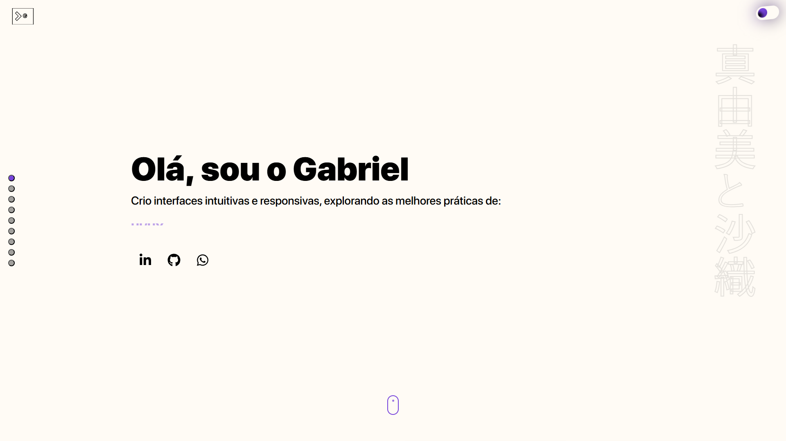
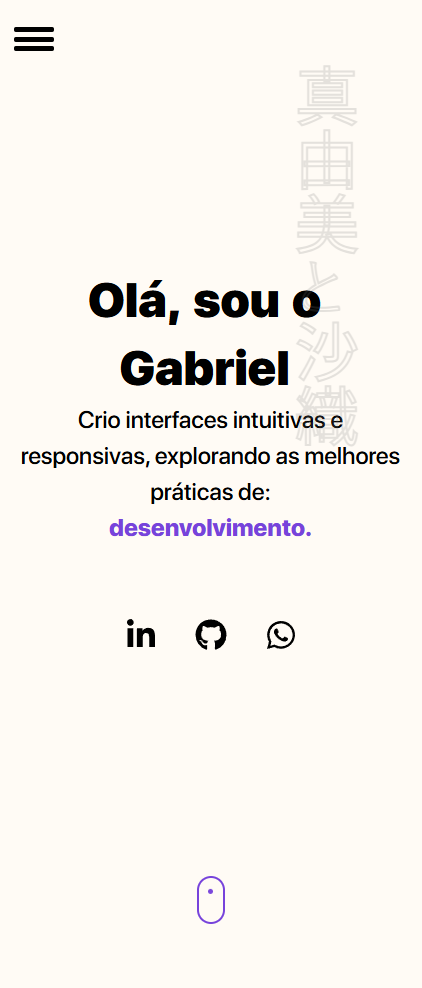

# 💼 Gabriel Nascimento Portfolio — Meu Portfólio Interativo

Este é o repositório do meu portfólio pessoal, construído com foco em animações modernas, responsividade adaptativa e tecnologias atuais do front-end. O projeto foi pensado para demonstrar minhas habilidades com interfaces ricas, interações visuais e código limpo e modular.

---

## 🚀 Tecnologias e Bibliotecas

- [React](https://reactjs.org/)
- [TypeScript](https://www.typescriptlang.org/)
- [Styled-components](https://styled-components.com/)
- [GSAP (GreenSock)](https://gsap.com/)
- [Framer Motion](https://www.framer.com/motion/)
- [AOS (Animate on Scroll)](https://michalsnik.github.io/aos/)
- [React Icons](https://react-icons.github.io/react-icons/)
- [ESLint](https://eslint.org/)
- [Prettier](https://prettier.io/)

---

## ✨ Funcionalidades

- 🔁 Animações com `GSAP`, `Framer Motion` e `AOS`
- 🧱 Componentes modulares e reutilizáveis
- 🧭 Layout responsivo adaptado para **mobile**, **tablet** e **desktop**
- 🧩 Modal interativo com infos extras do projeto
- 📱 Mockups dinâmicos por breakpoint
- 🎨 Estilização híbrida com Tailwind + Styled-components
- 🛠️ Padronização de código com `ESLint` e `Prettier`

---

## 🖼️ Screenshots

| Desktop (Mockup)                                    | Mobile (Mockup)                                   |
| --------------------------------------------------- | ------------------------------------------------- |
|  |  |

---

## 📁 Estrutura do Projeto

```
src/
├── assets/                      # Imagens e ícones do projeto
│   └── icons/                   # Ícones para o projeto
├── cards/                       # Componentes relacionados aos cards de projetos
│   ├── Anchor                   # Componente de navegação de âncoras
│   ├── Button                   # Botões reutilizáveis
│   ├── Card                     # Componente de Card para visualização de projetos
│   ├── Header                   # Cabeçalho do projeto
│   ├── Logo                     # Componente de logo
│   ├── Modal                    # Componente de Modal para exibição de detalhes
│   ├── ProjectCard              # Componente de visualização de projetos
│   └── PulsePointer             # Efeito de pulsação do ponteiro
├── Containers/                  # Containers para cada seção do projeto
│   ├── About                    # Seção "Sobre"
│   ├── Contact                  # Seção de "Contato"
│   ├── Footer                   # Rodapé do projeto
│   ├── Main                     # Seção principal
│   └── Projects                 # Seção de Projetos
├── gsap/                        # Arquivos para animações com GSAP
├── hooks/                       # Custom Hooks para funcionalidade extra
├── Image/                       # Manipulação de imagens
├── keyframes/                   # Animações e keyframes CSS
├── motion/                      # Efeitos de animações com React e Framer Motion
├── projects/                    # Dados de projetos e mockups
├── styles/                      # Estilos globais e componentes de estilo
└── types/                       # Tipos TypeScript para o projeto

```

---

## 🌍 Deploy

O projeto está disponível em produção via:
🔗 [https://personal-portfolio-flax-gamma.vercel.app/](https://personal-portfolio-flax-gamma.vercel.app/)

---

## 📌 Planejamento e Melhorias Futuras

- [ ] Testes com React Testing Library
- [ ] Migrar de React para Next visando novas interações entre paginas
- [ ] Migrar de Styled-Components para Tailwind (Styled nao vai mais receber atualizações)
- [ ] Acessibilidade (uso de ARIA + navegação por teclado)
- [ ] Sistema de internacionalização (i18n)

---

## 🤝 Contribuições

Este projeto é pessoal, mas sugestões e colaborações são bem-vindas!
Abra uma issue ou envie um pull request.

---

## 💡 Dica final

Se você estiver vendo esse repositório como recrutador: obrigado pela visita!
Esse projeto foi feito com carinho e atenção aos detalhes. Qualquer dúvida, estou à disposição! 😊

---
